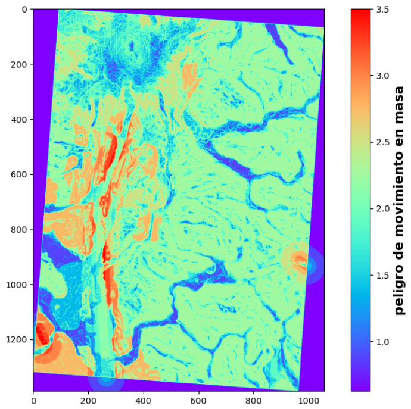
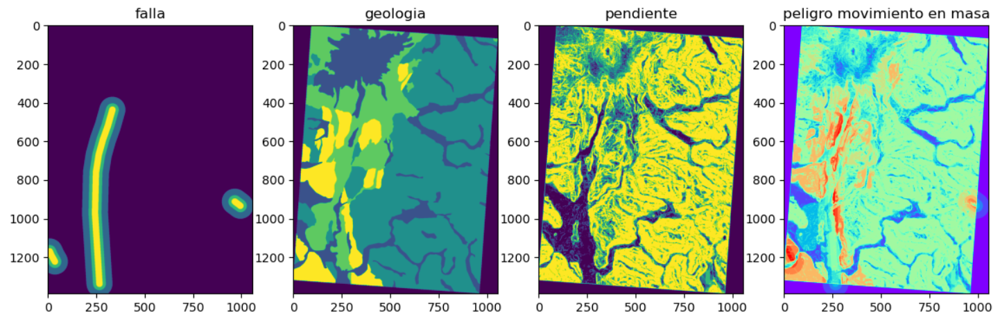
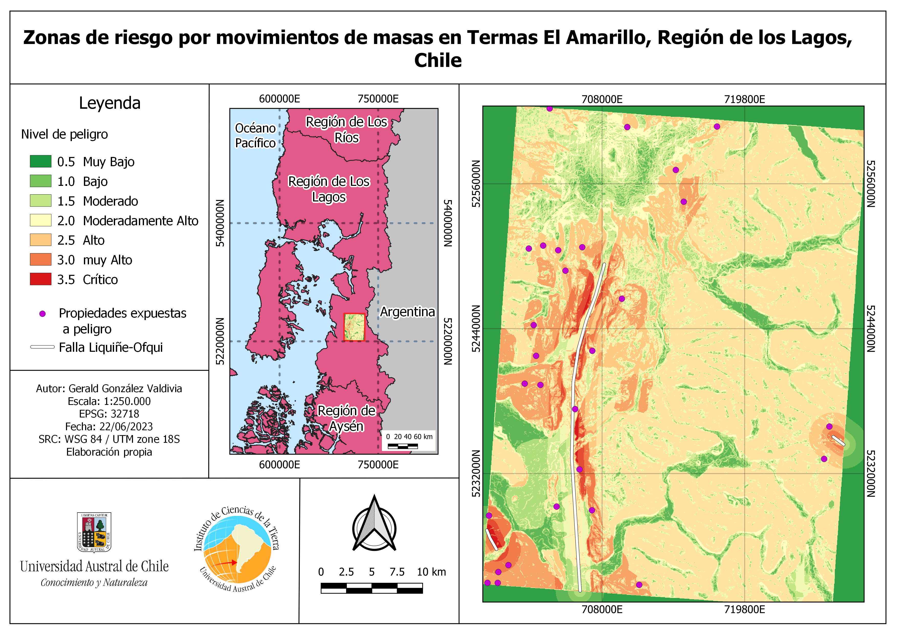

# Landslide Susceptibility Mapping using Weighted Overlay

Este proyecto presenta un flujo de trabajo reproducible para elaborar un mapa de susceptibilidad a movimientos en masa mediante un análisis multicriterio (*Weighted Overlay*), utilizando **QGIS**, **Python** y **Jupyter Notebook**.

El procedimiento combina variables ambientales previamente reclasificadas para generar un índice espacial de susceptibilidad que permite identificar sectores con mayor probabilidad de ocurrencia de procesos de remoción en masa.

---

# Requirements | Requisitos

<p align="center">

&nbsp;&nbsp;&nbsp;

&nbsp;&nbsp;&nbsp;

</p>

Este proyecto requiere trabajar de forma complementaria entre **QGIS** y **Jupyter Notebook**.

**QGIS**

- Preparación de datos.
- Rasterización de capas vectoriales.
- Cálculo de pendientes.
- Cálculo de distancias.
- Reclasificación de variables.

**Jupyter Notebook**

- Lectura de raster mediante Rasterio.
- Integración de variables.
- Aplicación de la suma ponderada.
- Exportación del raster final.
- Cálculo de estadísticas.

> ⚠️ **Antes de ejecutar el notebook, modifique las rutas de los archivos para que correspondan a la ubicación de los datos en su propio equipo.**

---

# Overview | Descripción general

El análisis multicriterio (*Multi-Criteria Decision Analysis*, MCDA) es una metodología ampliamente utilizada en Sistemas de Información Geográfica para integrar múltiples variables espaciales mediante criterios previamente definidos.

En este proyecto se implementa una combinación lineal ponderada (*Weighted Overlay*), donde las variables ambientales son reclasificadas y posteriormente integradas para construir un índice de susceptibilidad a movimientos en masa.

Este ejercicio fue desarrollado con fines académicos para demostrar una metodología reproducible utilizando herramientas de código abierto.

---

# Workflow | Flujo de trabajo
```mermaid
graph LR
    DEM["🗺️ DEM"] --> SLOPE["📊 Calculate<br/>Slope"]
    FALLAS["🗺️ Geological<br/>Faults"] --> RASTER_FALLAS["🔧 Rasterize<br/>Faults"]
    GEOLOGIA["🗺️ Geological<br/>Environment"] --> CLASS_GEO["✏️ Reclassify<br/>Geology"]
    
    SLOPE --> RECLASS_SLOPE["✏️ Reclassify<br/>Slope"]
    RASTER_FALLAS --> DIST_FALLAS["📐 Calculate<br/>Distance"]
    DIST_FALLAS --> RECLASS_DIST["✏️ Reclassify<br/>Distance"]
    CLASS_GEO --> RASTER_GEO["🔧 Rasterize<br/>Geology"]
    
    RECLASS_SLOPE --> OVERLAY["⚖️ Weighted<br/>Overlay"]
    RECLASS_DIST --> OVERLAY
    RASTER_GEO --> OVERLAY
    
    OVERLAY --> RESULTADO["✅ Susceptibility<br/>Raster"]
    RESULTADO --> EXPORT["💾 Export<br/>Raster"]
    EXPORT --> STATS["📈 Calculate<br/>Statistics"]
    
    style DEM fill:#e1f5ff
    style FALLAS fill:#e1f5ff
    style GEOLOGIA fill:#e1f5ff
    style OVERLAY fill:#fff3e0
    style RESULTADO fill:#e8f5e9
---
# Input Data | Datos de entrada

Para reproducir el ejercicio se requieren los siguientes insumos:

- Modelo Digital de Elevación (DEM)
- Fallas geológicas
- Ambiente geológico

Los datos originales no se incluyen en este repositorio debido al tamaño de los archivos.
```
---

# Methodology | Metodología

## 1. Geological Fault Distance | Distancia a fallas geológicas

La capa de fallas geológicas fue rasterizada y posteriormente se calculó la distancia euclidiana desde cada píxel hasta la falla más cercana. Finalmente, el raster fue reclasificado en cuatro niveles de susceptibilidad.

### Herramientas utilizadas en QGIS

```text
gdal:rasterize

gdal:proximity

grass7:r.reclass
```

---

## 2. Geological Environment | Ambiente geológico

La capa vectorial del ambiente geológico fue reclasificada asignando un valor numérico a cada unidad litológica según su susceptibilidad relativa. Posteriormente, la información fue convertida a formato raster.

### Herramientas utilizadas

```text
GeoPandas

gdal:rasterize
```

---

## 3. Slope | Pendiente

La pendiente fue calculada a partir del Modelo Digital de Elevación y posteriormente reclasificada en cuatro categorías.

### Herramientas utilizadas en QGIS

```text
native:slope

grass7:r.reclass
```

---

## 4. Weighted Overlay | Suma ponderada

Las capas raster reclasificadas fueron integradas mediante una combinación lineal ponderada. En este ejercicio se asignó una mayor ponderación a la pendiente respecto de las demás variables para obtener el índice final de susceptibilidad.

<p align="center">

</p>

---

# Results | Resultados

La siguiente figura muestra las variables utilizadas en el análisis junto con el raster de susceptibilidad obtenido mediante la suma ponderada.

<p align="center">

</p>

Posteriormente, el raster fue integrado en una composición cartográfica para facilitar la interpretación espacial de los resultados.

<p align="center">

</p>

Durante el ejercicio se obtuvo:

- **193.79 km²** con un índice de susceptibilidad **mayor o igual a 2.5**.
- **28 propiedades** ubicadas en zonas con susceptibilidad **mayor o igual a 2.5**.

---

# Software | Software utilizado

- Python
- Jupyter Notebook
- QGIS
- GDAL
- GRASS GIS
- Rasterio
- GeoPandas
- NumPy
- Matplotlib

---

# Resources | Recursos utilizados

El flujo completo del procesamiento se encuentra documentado en:

- `notebooks/weighted_overlay_colab.ipynb`

Durante el desarrollo del proyecto se utilizaron los siguientes directorios del repositorio:

- `data/raster/`
- `data/vector/`
- `data/processed/`
- `images/`
- `outputs/`

> Actualice las rutas del notebook para que coincidan con la ubicación de estos directorios dentro de su entorno de trabajo.

---
**Importante:** Este código está diseñado específicamente para análisis de remociones en masa en contextos de fallas geológicas activas. ⚠️ NO usar este modelo en áreas sin fallas o estructuras geológicas similares sin validación previa.

# Acknowledgements | Agradecimientos

*Este proyecto fue desarrollado originalmente como parte del curso **Aplicaciones de los Sistemas de Información Geográfica (SIG) y Ordenamiento Territorial con SIG y TICs** de la carrera de **Geografía** de la **Universidad Austral de Chile (UACh)**.*

*La actividad original fue adaptada para este repositorio con el propósito de documentar un flujo de trabajo reproducible para la elaboración de mapas de susceptibilidad a movimientos en masa mediante análisis multicriterio (*Weighted Overlay*), utilizando **Python**, **QGIS** y **Jupyter Notebook**.*
